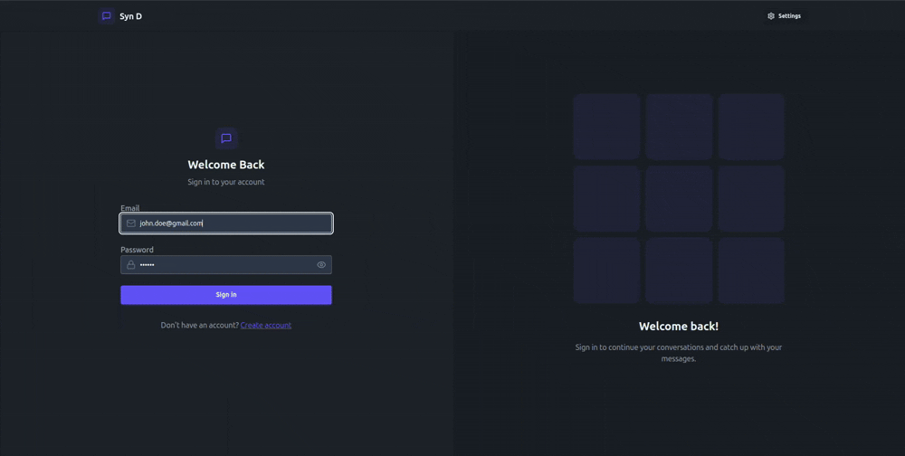

# Fullstack Chat App

A real-time chat application with authentication, messaging, and responsive UI.  



---

## Features

- User registration & login (JWT authentication)  
- Real-time messaging with Socket.IO  
- Online/offline user status  
- Private one-to-one chat  
- Media/image upload support  
- Responsive design for desktop and mobile  

---

## Prerequisites

Make sure you have the following installed:

- **Node.js** (v14+ recommended)  
- **npm** 
- **MongoDB** (cloud instance)  
- **Cloudinary account** (for image/media uploads)  

---

## Setup

Clone the repository:

```bash
git clone https://github.com/csr4422/fullstack_chat-app.git
cd fullstack_chat-app
```

# Install dependencies for both backend and frontend:
```bash
cd backend
npm install
cd ../frontend
npm install
```
# Running the App

Start Backend
```bash
cd backend
npm run dev   # for development (nodemon)
npm start     # for production
```

Start Frontend
```bash
cd frontend
npm start
```
